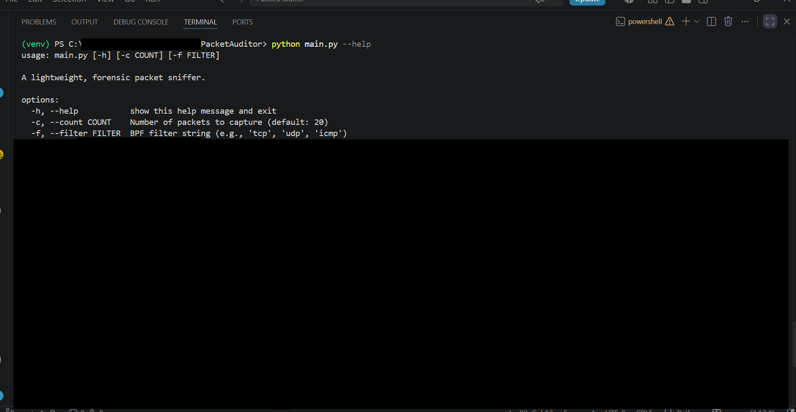
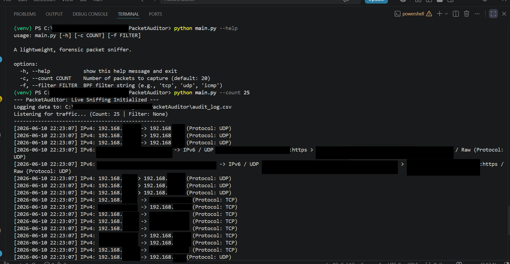
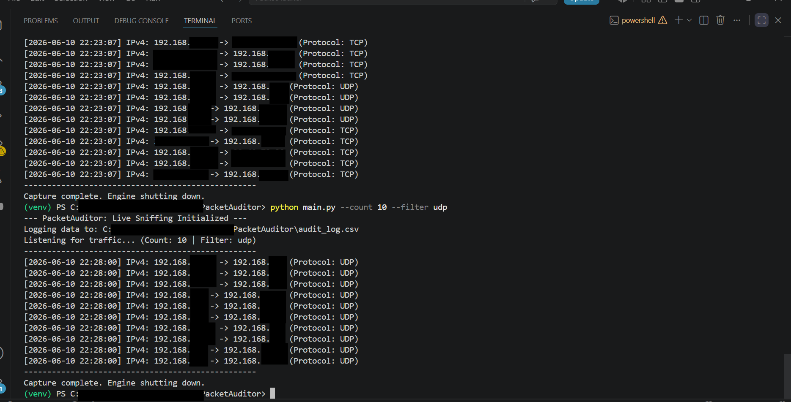

# PacketAuditor 🕵️‍♂️

A lightweight, strictly passive network traffic analyzer and forensic logging engine built in Python.

PacketAuditor leverages the Scapy library to place the host Network Interface Card (NIC) into promiscuous mode, capturing and analyzing raw TCP/IP frames. It translates transport protocols (TCP, UDP, ICMP) and seamlessly handles both IPv4 and IPv6/QUIC traffic in real-time.

Help Menu Demo, python main.py --help:
.

User Custom Count Demo (25 packets): python main.py --count 25
.

User Custom Filter Demo, python main.py --count 10 --filter udp:
.

## ⚙️ Technical Architecture
* **Language:** Python 3
* **Core Libraries:** `scapy`, `argparse`, `csv`, `os`
* **Data Persistence:** Automatically generates a timestamped `audit_log.csv` for forensic analysis and threat hunting.
* **Time Complexity Optimization:** Utilizes O(1) hash maps for rapid protocol translation during high-volume packet floods.

## 🛡️ Security & Privacy Guarantee
* **100% Passive Observer:** PacketAuditor is a read-only sensor. It analyzes packet headers and immediately flushes them from RAM (`store=False`). It does not execute payloads or alter network traffic.
* **Zero Telemetry:** This tool operates entirely locally. No captured data, IP addresses, or metrics are ever transmitted to an external server or cloud database.
* **Privilege Requirement:** Interacting with raw hardware interfaces in promiscuous mode requires Administrator/root execution to ensure unauthorized background apps cannot silently monitor traffic.

## 🚀 Usage Interface

To run: Initialize your virtual environment and install the dependencies:

Run the engine with administrative privileges. Use the built-in CLI arguments to control the capture parameters:

Display the help menu:

python main.py --help

Capture exactly 50 packets:

python main.py --count 50

Filter for specific protocols (e.g., isolate all UDP traffic):

python main.py --count 100 --filter udp
